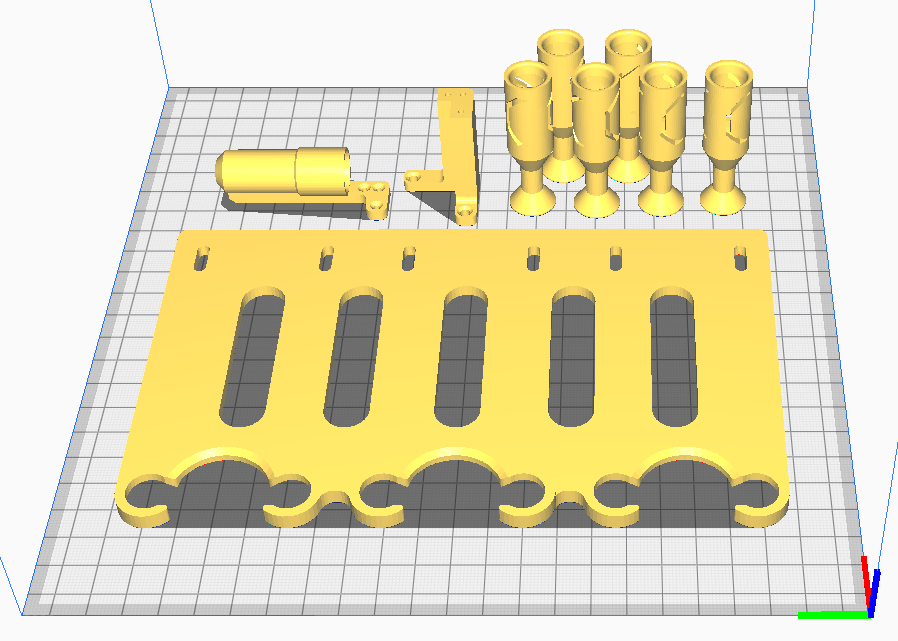
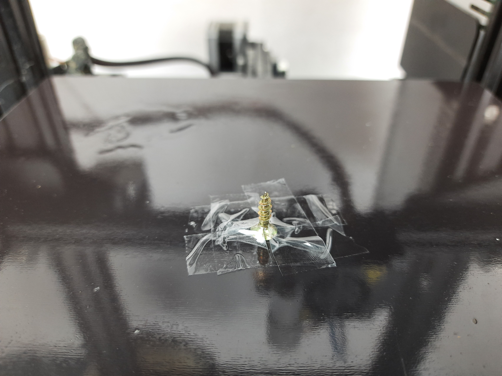
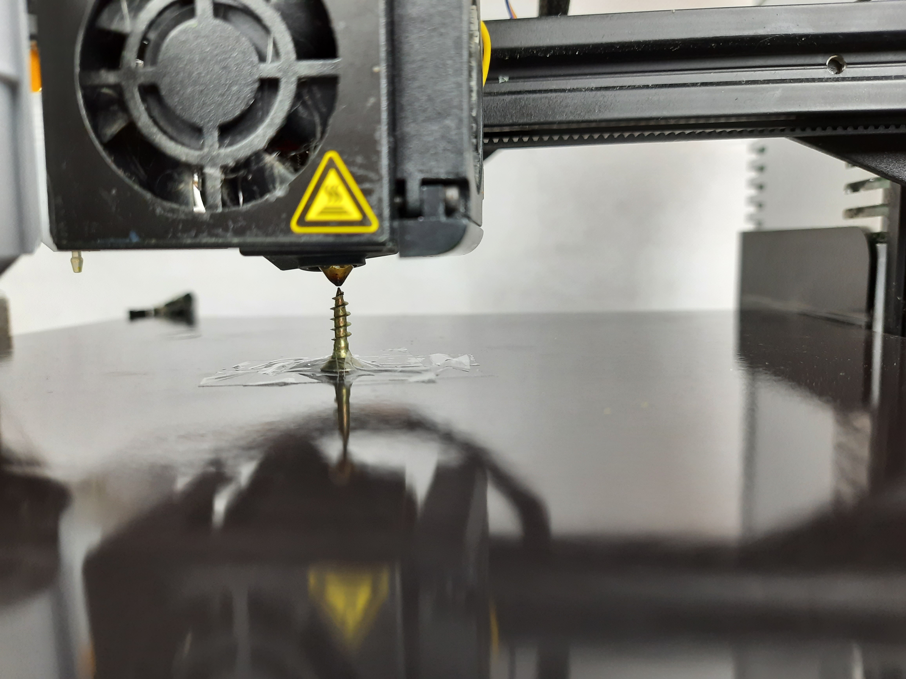
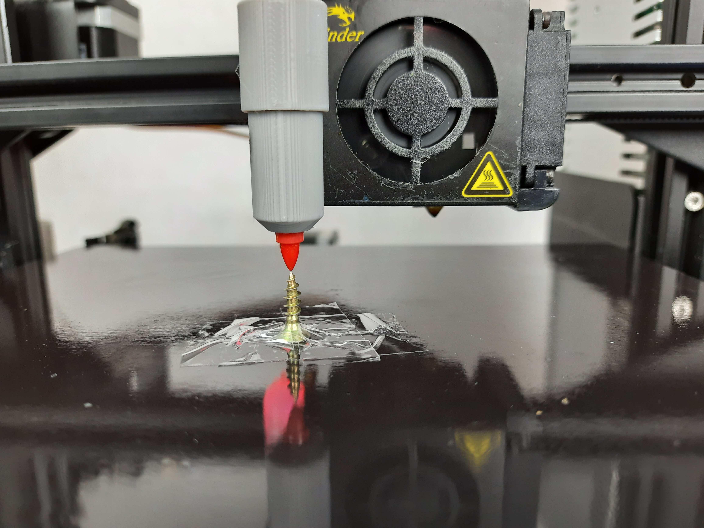

# Hardware setup

## Printing the parts
First print the STL files located in the *Hardware* folder. Right now only the files for an Ender 3 (or similar Ender 3 clone) are provided. It´s adviced to print all the files with a brim so they are perfectly flat and don´t topple over while printing.

For working with 6 colors you need to print 6 pen caps, the pen rack, the pen holder arm and one of the pen holders.

For the pen holder part you can choose between a variant for Sharpies only and one for Sharpies, Amazon Basic Markers and Shuttle Art Markers. The later one is a litte bit lose for Sharpies so it´s adviced to use the first one if you only want to use Sharpie markers.

*recommended printing orientations*
## Preparing the pens
To prepare the sharpies for printing, place the end cap on the back of the pen. The cap should hold the pen tightly and don´t slip of easily.
[Image]
## Mounting the parts
You need to mount the pen holder to your extruder head first. To do so you need to unscrew the 2 screws shown in the picture.
[Image]
Now put the mounting part in place and screw everything back in. After that You can mount the pen holder to the mounting part with 3 M2 screws.
[Image]
The pen rack needs to be mounted to the upper t-slot profile of your printer. If you have an Ender 3 you should have 2 spare screws and corrosponding t nuts you can use for that.
To reduce stress on the bowden cable it is adviced to place the rack as far left as possible. 
[Image]

**Important:** when mounting the racket you need make sure that a pen sitting in the pen holder can be easily slided in and out of the individual rack holders! If it doesn´t fit perfectly just slightly unscrew the rack and reposition it until it fits.
[Image]

## Calibrating the pen holder
In this step we need to figure out the relative position of the pen when it´s in the holder to the nozzle. To do so tape or otherwise fix a screw or something similar to your print bed.

*screw taped to print bed*

Now **turn OFF** your printer and manually place the nozzle just over the screw.

*nozzle placed directly over the srew*

Now **turn ON** your printer. **Do not home the axis**. Place a pen inside the holder and use your printers settings to move the pen directly over the screw. For an Ender 3 the move axis settings are under *prepare->move axis*. Use the 0.1 mm step size when positioning the axis.

*pen placed directly over the srew*

Write down the X, Y and Z coordinates. You need them later on when configuring the software.
## Calibrating the pen rack
Now we need to figure out the position of the first pen in the rack. 
To do this **turn ON** your printer and **home all axis**. Put a pen with the printed end cap inside the pen holder. After that use your printers menu to move the pen to the position shown in the image.

*pen placed directly over the srew*

Write down the X and Z coordinates. You need them later on when configuring the software.

