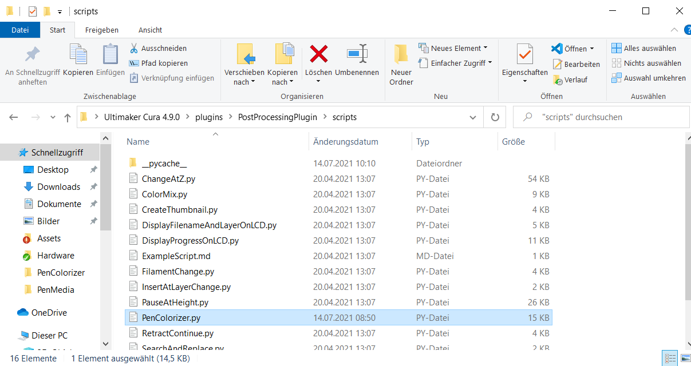
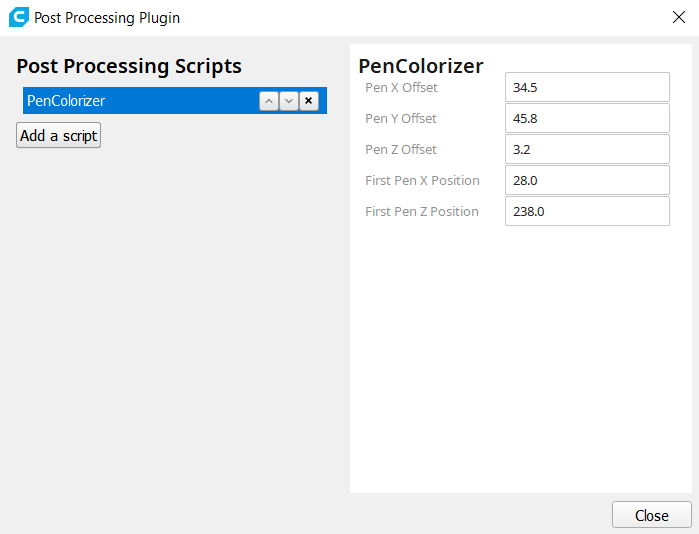
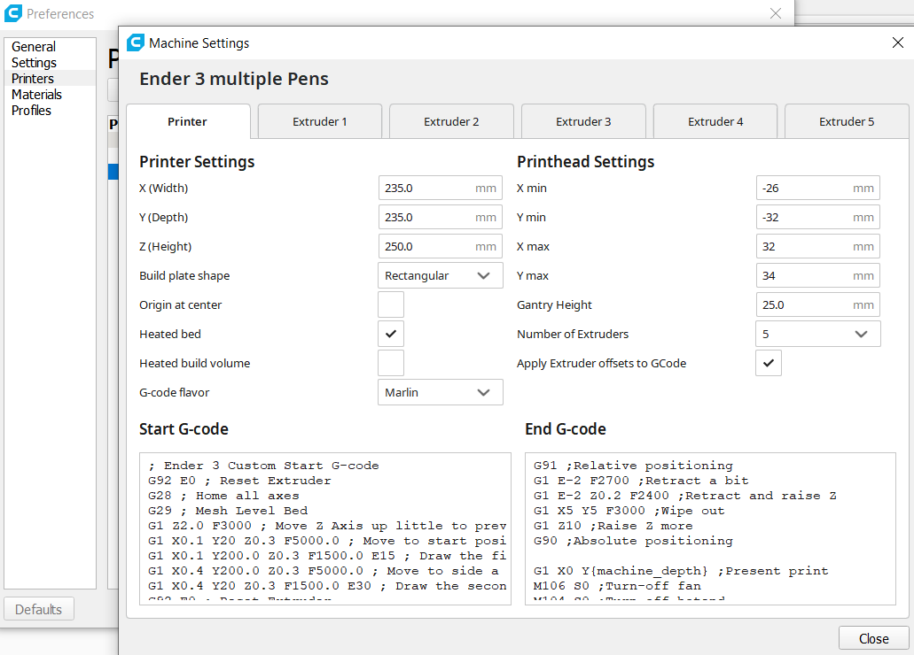
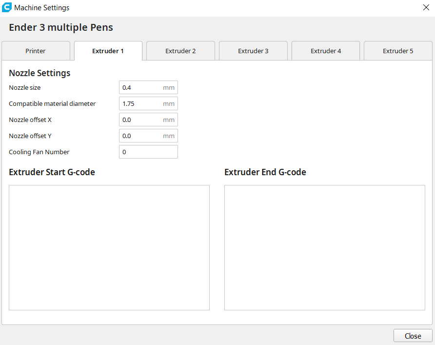
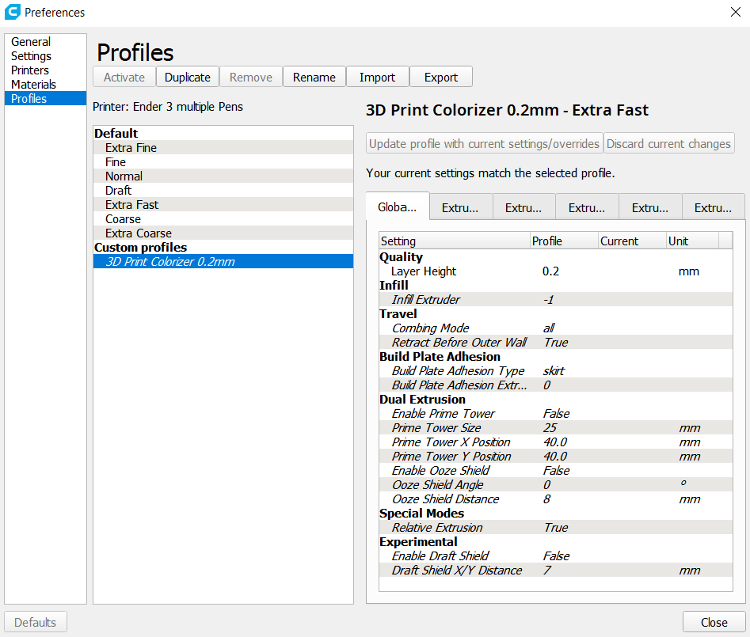

# Software Setup
## Installing the Cura plugin
The software is implemented as a [Cura](https://ultimaker.com/de/software/ultimaker-cura) plugin. To install the plugin just copy the *PenColorizer.py* file from the *Software* folder to *..\Ultimaker Cura x.x.x\plugins\PostProcessingPlugin\scripts*. 

*Script location*

If you had Cura running you need to restart it after copying the plugin.
After starting/restarting Cura you need to activate the plugin. Go to *Extensions->Post Processing->Modify G-Code*, click on *add a script" and chose the *PenColorizer* script.

*pen placed directly over the srew*

## Configuring the plugin
In the plugin settings window enter the configuration values you have written down during the hardware setup phase. The *Pen X,Y and Z Offsets* refer to the coordinates of the pen just over the screw. **Important:** for the Z Offset you should substract 2-2.5 mm from the value you have written down to make sure the has a good contact with the surface when coloring the printed layers.

*position for Pen X,Y and Z Offset*

The *First Pen X and Z Positions" refer to position of the print head when the first pen is hold in the rack.

*first pen position*

## Creating the machine profile
The 3D print colorizer works by modifying the g-code generated by a virtual multiextruder printer so that it´s using permanet markers to paint the print instead of actually using more than one nozzle. To do this we need to create a virtual multiextruder in Cura first. To do so go to *Settings->Printer->Add printer* and under *Add non-networked printer* Add a custom FFF Printer. 

On the next page you need to enter your machine/printer settings. These should be the same as 1for your actual printer! You can switch back to your real printers settings and make screenshot or note them down if you are unsure about this settings. Don´t forget to also copy the start and end g-code. Now you can add up to 7 extruders to your printer. The first extruder always refers to an unpainted surface so you can use 6 real colors when going with 7 extruders..

*correct settings for an Ender 3 with 4 colors*

After Adding the extruders you need to go to each extruder tab individually and configure them. **Important**: by default the *compatible material diameter* property is **NOT** set to 1.75mm. You need to change this in every extruder tab.

*filament diameter set to 1.75mm*

## Configuring the printing profile
To start printing right away you can start by using the *CuraProfile.curaprofile* file located in the *Software* folder. To import the profile go to *Preferances->Configure Cura..->Profiles* and click on *Import*.

*profiles window*

When creating your own printing profile the following settings are important:

| Property        | Recommended value           | Description  |
| ----------------- |-------------| -----|
| Relative Extrusion      | True | The plugin only works with this activated. |
| Combing Mode      | All      |    |
| Wall line count      | 2      | We can reduce this to 2 since we only need to paint 2 walls then. This is enough and we will compensate for the loss in stability with some support walls later on.   |
| Infill density      | 40%      | Since layer adheasion is quite poor for the painted parts we need to improve it with more infill.   |
| Extra infill wall count      | 5      | These walls print very quickly and compensate for the loss in "real" walls.   |
| Printing temperature      | Low      | Low temperatures are adviced to reduce the oozing when the extruder is idle.   |
| Outer wall speed     | 10-15      | This should be greatly reduced to improve layer adheasion.   |
| Top/Bottom speed      | 30      | This should be greatly reduced to improve layer adheasion.   |
| Enable Retraction      | True      |    |
| Retract at Layer Change      | True      |    |
| Retract before outer wall      | True      | This needs to bo on otherwise the pen will draw over eachother.   |
| Build plate adheasion extruder      | Extruder 1      | We don´t want to paint the adheasion lines.   |

**Important**: if you change some values in your profile you need to copy this values to all of your extruders by right clicking on the property and selecting *copy value to all exruders*. Do this for every value you changed. The option *copy all changed values to all extruders* seems to be broken right now. 